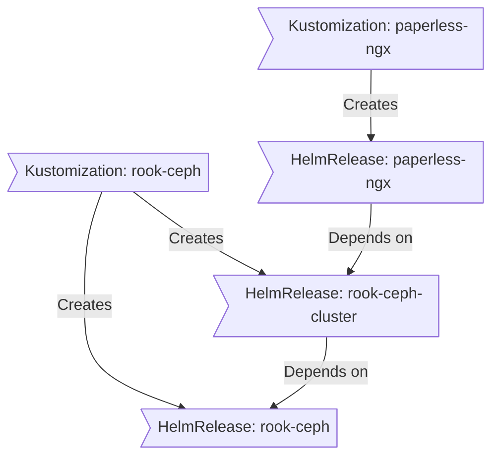

<div align="center">

### My Home Operations Repository 

_... managed with [Flux](https://github.com/fluxcd/flux2), [Renovate](https://github.com/renovatebot/renovate), and [Forgejo Actions](https://forgejo.org/docs/latest/user/actions/)_ 

</div>

<div align="center">

[](https://talos.dev)&nbsp;&nbsp;
[](https://kubernetes.io)&nbsp;&nbsp;
[](https://github.com/home-operations/kromgo)&nbsp;&nbsp;
[](https://github.com/home-operations/kromgo)&nbsp;&nbsp;
[](https://github.com/home-operations/kromgo)

</div>

<div align="center">

[](https://github.com/home-operations/kromgo)&nbsp;&nbsp;
[](https://github.com/home-operations/kromgo)&nbsp;&nbsp;
[](https://github.com/home-operations/kromgo)&nbsp;&nbsp;
[](https://status.xcd.dev)

</div>

---

##  Overview

This is a mono repository for my home infrastructure and Kubernetes cluster. I try to keep everything as code, from the operating system on the nodes down to the individual application releases, including the hosts that run outside the cluster.

- [Talos Linux](https://github.com/siderolabs/talos) — immutable, API-driven OS that runs nothing but Kubernetes.
- [Flux](https://github.com/fluxcd/flux2) — reconciles the cluster against this repository.
- [Renovate](https://github.com/renovatebot/renovate) — opens pull requests for dependency updates across the whole repo.
- [Ansible](https://www.ansible.com) and [doco-cd](https://github.com/kimdre/doco-cd) — provision and deploy the off-cluster hosts.

---

##  Kubernetes

My cluster runs on [Talos](https://www.talos.dev), three mini PCs as control plane plus a GPU box joined as a worker. It is hyper-converged, workloads and block storage share the same resources on the control plane nodes, while a separate ZFS server provides NFS shares and holds the backups.

### Core components

- **Networking**: [cilium](https://github.com/cilium/cilium) provides eBPF networking, BGP and LB-IPAM, while [envoy-gateway](https://gateway.envoyproxy.io) handles ingress through the Gateway API and [towonel](https://codeberg.org/towonel/towonel) tunnels public traffic in from the VPS. [multus](https://github.com/k8snetworkplumbingwg/multus-cni) puts a few pods on a real VLAN for mDNS, and [external-dns](https://github.com/kubernetes-sigs/external-dns) keeps Cloudflare and UniFi records in sync.
- **Security & Secrets**: [cert-manager](https://github.com/cert-manager/cert-manager) manages certificates and [authentik](https://github.com/goauthentik/authentik) handles SSO. For secrets I use [external-secrets](https://github.com/external-secrets/external-secrets) with [1Password Connect](https://github.com/1Password/connect), so none live in Git.
- **Storage & Backups**: [rook-ceph](https://github.com/rook/rook) provides RBD and CephFS volumes, with [kopiur](https://github.com/home-operations/kopiur) backing them up to the NAS and offsite. Databases run on [CloudNativePG](https://github.com/cloudnative-pg/cloudnative-pg) and caches on [Dragonfly](https://github.com/dragonflydb/dragonfly).
- **Observability**: [VictoriaMetrics](https://github.com/VictoriaMetrics/VictoriaMetrics) and VictoriaLogs store metrics and logs, with dashboards from [grafana-operator](https://github.com/grafana/grafana-operator), health checks from [gatus](https://github.com/TwiN/gatus), and alerts sent to Pushover and [karma](https://github.com/prymitive/karma).
- **Automation & CI/CD**: [Forgejo](https://forgejo.org) hosts this repository and its Actions runners, and [konflate](https://github.com/home-operations/konflate) renders every pull request through Flux to post the diff.

### GitOps

Flux watches the [kubernetes](./kubernetes/) folder and applies what is in it. It searches `kubernetes/apps` for the top level `kustomization.yaml` in each directory, which usually holds a namespace and one or more Flux kustomizations (`ks.yaml`). Those apply the `HelmRelease` and the other resources for the application.

Renovate watches the entire repository for dependency updates and opens a PR when it finds one. When the PR is merged Flux applies the change to the cluster.

### Directories

```sh
📁 ansible     # provisioning for the off-cluster hosts
📁 bootstrap   # bringing a fresh cluster up from nothing
📁 docker      # compose stacks for the off-cluster hosts
📁 kubernetes  # the cluster itself
📁 talos       # machine config rendering
```

```sh
📁 kubernetes
├── 📁 apps       # applications, grouped by namespace
├── 📁 components # reusable kustomize components
└── 📁 flux       # flux configuration
```

### Flux dependency flow

A `HelmRelease` can depend on other releases, and a `Kustomization` on other kustomizations. In the example below paperless is not installed or upgraded until the Ceph cluster is healthy.



---

##  Hardware

### Compute

**Lenovo M920Q (Core i5-8500T) × 3 · 64 GB DDR4 · Talos / Kubernetes**

- **OS & etcd** — 480 GB Micron 5300/5400 PRO SATA SSD (power-loss protection)
- **Rook-Ceph** — 1 TB Samsung 990 PRO NVMe (2280)
- **Miroir** — 256 GB SK hynix BC511 NVMe, replicated with DRBD
- **Network** — 1 G onboard (disabled) + Mellanox 10/25 G SFP+

**MS-02 Ultra (Core Ultra 9 285HX) · 96 GB DDR5 · Talos / Kubernetes**

- **GPU** — NVIDIA RTX PRO 4000 Blackwell SFF, 24 GB
- **OS & Miroir** — 1 TB SK hynix Platinum P41 NVMe
- **Network** — 10 G Realtek + 2.5 G Intel, active-backup bond

### Storage

**Ugreen DXP4800 Plus · 32 GB DDR5 · TrueNAS SCALE / ZFS**

- **Boot** — 128 GB NVMe
- **home-pool** — 7.25 TB
  - 2 × 4 TB Seagate IronWolf CMR — mirror
  - 2 × 4 TB Seagate IronWolf CMR — mirror
- **fast-pool** — 236 GB
  - 2 × 256 GB Samsung PM981 NVMe — mirror
- **Network** — 2.5 G + 10 G

### Networking — UniFi

- **Cloud Gateway Fiber** — router · 2×10 G SFP+, 1×10 G RJ45, 4×2.5 G RJ45
- **Switch Aggregation** — 8×10 G SFP+
- **Switch Pro Max 16 PoE** — 12×1 G PoE+ (30 W), 4×2.5 G PoE++ (60 W), 2×10 G SFP+

---

##  Cloud dependencies

While most of my infrastructure is self-hosted, I rely on the cloud for a few parts of the setup. This keeps me from dealing with chicken and egg scenarios, and means alerting still reaches me when the cluster is offline.

| Service                                  | Use                                                             | Cost           |
| ---------------------------------------- | --------------------------------------------------------------- | -------------- |
| [1Password](https://1password.com)       | Secrets with [External Secrets](https://external-secrets.io)     | ~€50/yr        |
| [Cloudflare](https://www.cloudflare.com) | Domain and DNS                                                  | Free           |
| [GitHub](https://github.com)             | Public mirror of this repository                                | Free           |
| [Hetzner](https://www.hetzner.com)       | Edge VPS and offsite backups                                    | ~€10/mo        |
| [Pushover](https://pushover.net)         | Kubernetes alerts and app notifications                         | $5 OTP         |
| [Resend](https://resend.com)             | Outbound email                                                  | Free           |
|                                          |                                                                 | Total: ~€14/mo |

---

##  Thanks

A lot of what is here came from the [Home Operations](https://discord.gg/home-operations) community and from the repositories of [onedr0p](https://github.com/onedr0p/home-ops), [bjw-s](https://github.com/bjw-s-labs/home-ops), [buroa](https://github.com/buroa/k8s-gitops) and [eleboucher](https://github.com/eleboucher/homelab). There is a template over at [onedr0p/cluster-template](https://github.com/onedr0p/cluster-template) if you want to follow along with some of the practices used here.

---

##  License

See [LICENSE](./LICENSE).
